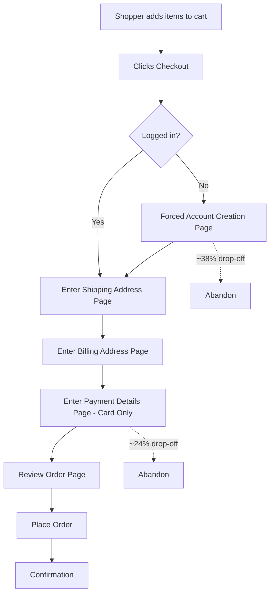
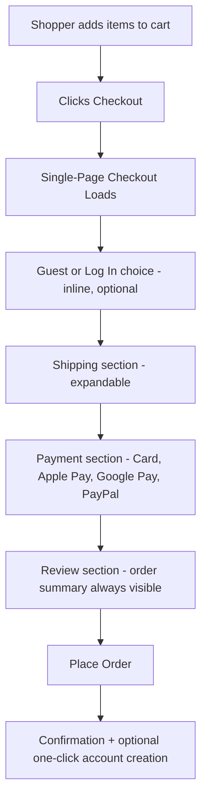

# Process Map — E-Commerce Checkout Revamp

## As-Is Process (Current State)

**Pain points identified**
- Mandatory account creation before any shipping or payment info is entered — the single largest drop-off point.
- Five separate page loads, each an additional chance to abandon.
- Card-only payment excludes wallet users, disproportionately affecting mobile shoppers.
- No visibility into remaining steps or running total until the review page.

## To-Be Process (Redesigned)

**Key changes**
- Account creation moved from a blocking gate to an optional, post-purchase prompt.
- Shipping, billing, and payment collapsed into one scrollable page with expandable sections, replacing five separate pages.
- Payment options expanded to include digital wallets, cutting manual data entry.
- A persistent order summary and step indicator (not shown in the diagram, see [BRD](./BRD.md) FR-04/FR-05) remain visible throughout.

## Estimated Funnel Impact

| Stage | As-Is Completion | To-Be Target |
|---|---|---|
| Reach checkout | 100% | 100% |
| Pass account/guest step | 62% | 95% |
| Complete shipping + payment | 76% of remaining | 90% of remaining |
| Place order (overall) | 28% | 45% |
